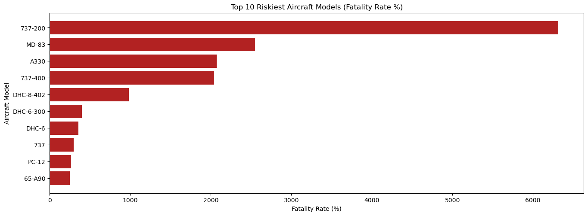
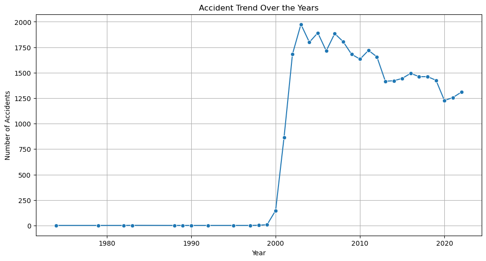
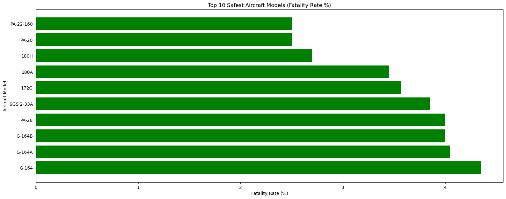

# **AVIATION SAFETY RISK ANALYSIS PROJECT**

## **Overview**
This project involves the analysis of aviation accident data from 1962 to 2023 using real-world data from the National Transportation Safety Board (NTSB). The goal is to determine and provide actionable insights to the head of the aviation division about the safest and low risk aircrafts for a company expanding into the aviation industry to to help make informed decisions on aircraft purchases.

## **Business Understanding**
As the company diversifies into the aviation industry, understanding the potential risks of aircraft is crucial. The objective is to determine which aircraft present the least risk, so the company and head of aviation division can make informed strategic investments for both commercial and private enterprises.

## **Key Business Questions:**
Which aircraft models have the lowest accident rates over the years based on historical accident data?
Are there specific years, seasons or periods with higher risks?
What are the common causes of aviation accidents that can be mitigated?
Are there any specific manufacturers or aircraft types with lower accident rates?
How can the company use this data to make smarter purchasing decisions?

## **Data Understanding and Analysis**
The dataset comes from the National Transportation Safety Board (NTSB) and includes information on aviation accidents in the United States and international waters. The data includes key fields such as: Aircraft make and models, Accident severity and causes, Date and location of accidents

## **Data Source:**
National Transportation Safety Board (NTSB) aviation accident data (1962 - 2023).

## **Data Description**
The dataset contains multiple columns including:
Accident ID: Unique identifier for each accident.
Aircraft Model: Type of aircraft involved in the accident.
Accident Date and Location: Date when and where the accident occurred.
Fatalities: Number of fatalities in the accident.
Accident Cause and : The identified cause of the accident.

## **Visualizations:**
Accident trends by aircraft model

Accidents over time (yearly trend)

Risk distribution by aircraft type and accident severity

These visualizations are presented in the project’s Jupyter notebook and integrated into an interactive Tableau dashboard for ease of exploration.
View the interactive dashboard here:  
[🔗 Click to View](https://public.tableau.com/app/profile/allan.ofula/viz/AVIATIONSAFETYRISKANALYSISVISUALIZATION/Dashboard1?publish=yes)

## **Conclusion**
The analysis has identified key trends in aviation accidents and provided recommendations on which aircraft to prioritize based on their historical safety records. The three business recommendations based on the findings are as follows:

-Invest in aircraft models with the lowest accident rates.
-Consider purchasing newer aircraft with better safety records.
-Monitor accident trends yearly to adjust purchasing decisions dynamically.
These insights will be shared with the head of avaition and stakeholders to inform purchasing decisions for the company’s expansion into the aviation industry.

## **Repository Structure:**
README.md 
-You're currently reading it!

Jupyter Notebooks 
-Contains all of the analysis work and documentation.

Presentation 
-A PDF of the non-technical presentation for stakeholders.

Interactive Dashboard 
-A link to the interactive Tableau dashboard where the visualizations can be explored in depth.

## **Getting Started**
To explore the project:

Clone this repository.
Open the student.ipynb Jupyter notebook to see the code and findings.
View the interactive dashboard here.

## **Acknowledgements**
Special thanks to the National Transportation Safety Board for providing the dataset, and to the entire data science community for the resources and inspiration behind this analysis.